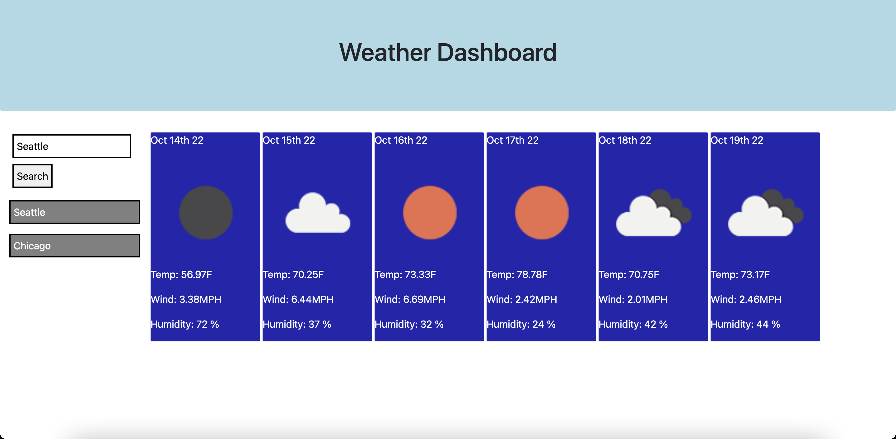

# WeatherApp
This application shows weather outlook of the chosen city.

## Description
This application shows 5 day weather forecast of the chosen city. User can choose a city either by providing its name in the input or select the city from the previous saved search history.

## Installation

N/A

## Usage
This project has an input box where user can provide the name of the city and click on submit button to view weather forecast of the city. All searches are also saved in the local storage and displayed below the input box. User can select a city by clicking on one of the previously saved searches.

Screenshots of different views of the website -

Link of deployed application - https://mypooja.github.io/weatherApp/

## Credits

N/A

## License

Please refer to the LICENSE in the repo.

